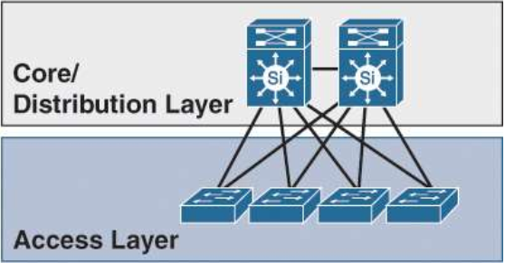

.. Network design intro

Базовые принципы 
#####################

Оптимальная локальная сеть предприятия.(*Optimal Enterprise Campus Design*)
===========================================================================

**Локальная сеть предприятия (Campus network)** - географически ограниченная сеть, которая обеспечивает доступ к услугам и ресурсам для конечных пользователей и устройств, может занимать один этаж, здание, или даже группу зданий.

Должна обеспечивать:

* Непрерывность услуг (*Nonstop high-availability services*)
* Доступность и мобильность услуг (*Access and mobility services*)
* Оптимизация и защита  (*Application optimization and protection services*)
* Виртуализацию услуг (*Virtualization services*)
* Безопасность услуг (*Security services*)
* Управление услугами (*Operational and management services*)

Принципы проектирования сетей предприятия (*Enterprise Campus Design Principles*)
=================================================================================

* Иерархия (*Hierarchy*)
* Модульность (*Modularity*)
* Гибкость (*Flexibility*)
* Устойчивость (*Resiliency*)

Иерархия (*Hierarchy*)
----------------------

Разбиение на уровни, каждый уровень обеспечивает определенные функции. Существует трехуровневая и двухуровневая модель сети.

* Трехуровневая модель
   * Уровень ядра (*Core Layer*)
   * Уровень распредиления (*Distribution Layer*)
   * Уровень доступа (*Access Layer*)

   
|

* Двухуровневая модель (*collapsed core*)
   * Уровень распредиления (*Distribution Layer*)
   * Уровень доступа (*Access Layer*)

|

Трехуровневая или двухуровневая модель?
~~~~~~~~~~~~~~~~~~~~~~~~~~~~~~~~~~~~~~~~~

В двухуровневой модели (*collapsed core*) ядро отсутствует и коммутаторы распределения подключаются по схеме каждый на каждого, в определенных случаях это дешевле (*cost-effective solution*). Кол-во соединений можно посчитать по формуле:

.. math::

   L = n*(n-1)/2

Где n количество коммутаторов распредиления. В случае с 4 блоками распредиления у нас будет 8 коммутаторов распредиления, 8*7/2=28, 28 линков для соединения каждый с каждым.

Наглядно:

.. image:: ../_static/tree_or_two.png
    :scale: 50 %
    :alt: Tree vs two
    :align: center

|

Компания cisco рекомендует задуматься о выделении отделного уровня ядра, если у Вас три и более блоков распредиления.

|

Уровень ядра (*Core Layer*)
~~~~~~~~~~~~~~~~~~~~~~~~~~~

Минимальный набор услуг, высокая скорость обработки. Ядро кампуса должно, практически беспрепятственно, восстанавливать поток данных в случае выхода из строя любого компонента (коммутатор, 
супервизор, линейная карта или оптоволокно).

.. image:: ../_static/core_lauer.png
    :scale: 50 %
    :alt: Core Layer
    :align: center

* Providing high-speed switching (i.e., fast transport)
* Providing reliability and fault tolerance
* Scaling by using faster, and not more, equipment
* Avoiding CPU-intensive packet manipulation caused by security, inspection, quality of service (QoS) classification, or other processes
|

Уровень распредeления (*Distribution Layer*)
~~~~~~~~~~~~~~~~~~~~~~~~~~~~~~~~~~~~~~~~~~~~

Агрегирует данные, полученные от коммутаторов уровня доступа, прежде чем они будут переданы на уровень ядра для маршрутизации до конечного пункта назначения. Уровень распределения очень часто является границей между доменами второго уровня и маршрутизируемой сетью третьего уровня.

.. image:: ../_static/distribution_layer.png
    :scale: 50 %
    :alt: Access Layer
    :align: center

* Aggregation of LAN or WAN links.
* Policy-based security in the form of access control lists (ACLs) and filtering.
* Routing services between LANs and VLANs and between routing domains (e.g., EIGRP to OSPF).
* Redundancy and load balancing.
* A boundary for route aggregation and summarization configured on interfaces toward the core layer.
* Broadcast domain control, because routers or multilayer switches do not forward broadcasts. The device acts as the demarcation point between broadcast domains.* 
|

Уровень доступа (*Access Layer*)
~~~~~~~~~~~~~~~~~~~~~~~~~~~~~~~~

Уровень доступа - это первый уровень, или край(*edge*), сети кампуса. Это место, где конечные точки (ПК, принтеры, камеры и т.д.) подключаются к проводной или беспроводной части кампусной сети, также место, где подключаются устройства которые расширяют сеть еще на один уровень. К таким устройствам относятся IP телефоны и беспроводные точки доступа (APs). L2 или L3 коммутаторы.

.. image:: ../_static/access_lauer.png
    :scale: 50 %
    :alt: Access Layer
    :align: center

* Layer 2 switching
* High availability
* Port security
* QoS classification and marking and trust boundaries
* Address Resolution Protocol (ARP) inspection
* Virtual access control lists (VACLs)
* Spanning tree
* Power over Ethernet (PoE) and auxiliary VLANs for VoIP
|

Модульность (*Modularity*)
--------------------------

Гибкость (*Flexibility*)
------------------------

Устойчивость (*Resiliency*)
---------------------------

